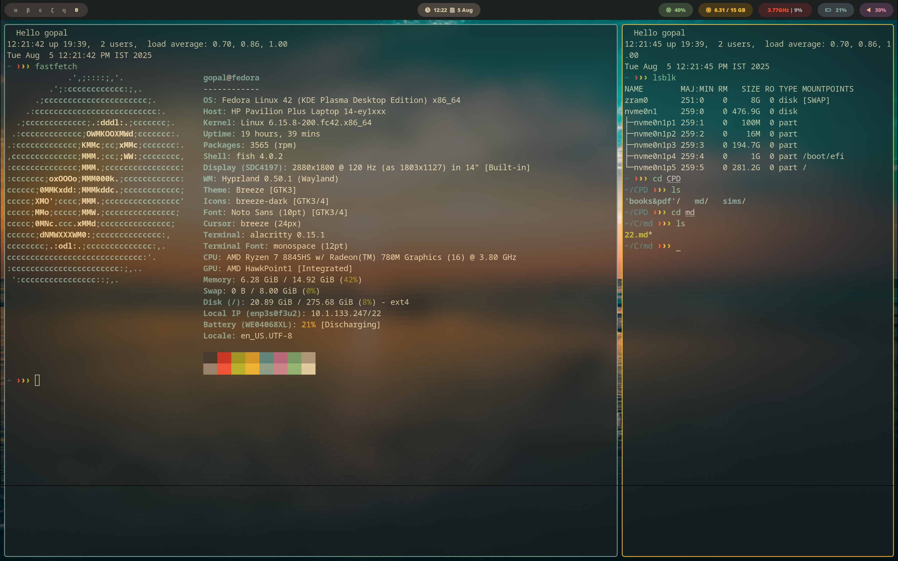
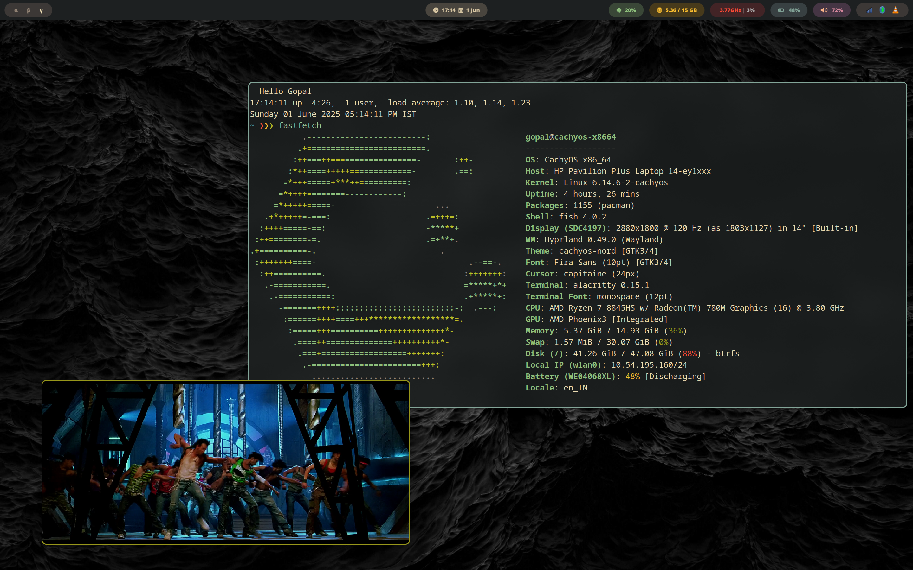
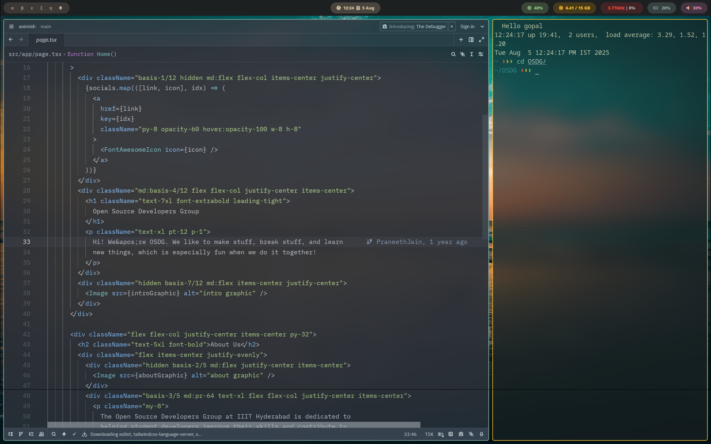

# Hyprland dotfiles

*My hyprland dotfiles. based off of cachyos [https://cachyos.org/](https://cachyos.org/). mostly following a [gruvbox color pallete](https://github.com/morhetz/gruvbox)*

> Not beginner friendly.

## Installation
copy paste to .config and pray that it works. not beginner friendly, create a pr if something is missing.

## useful resources :
- [Hyprland official Wiki](https://wiki.hyprland.org/)
- [Hyprland on Arch Wiki](https://wiki.archlinux.org/title/Hyprland)
- [Community list of useful tools for hyprland](https://github.com/hyprland-community/awesome-hyprland)

# wallpaper credit

Kishore V ( sourced from unsplash )
 
https://unsplash.com/photos/the-sun-is-setting-over-the-ocean-on-the-beach-taVGqBGCAdo

*Happy Ricing : )*

## screenshots

